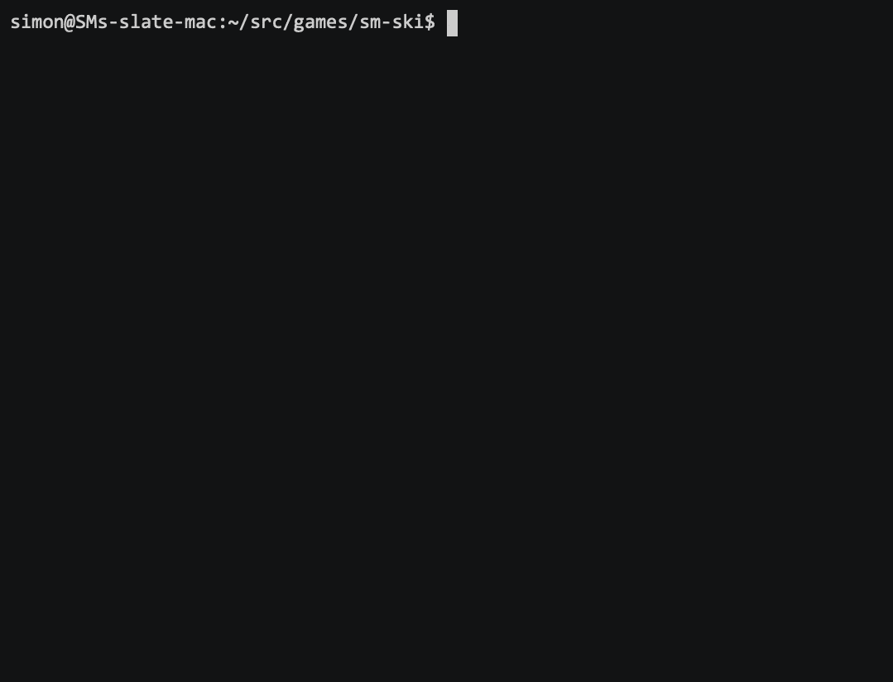

# ski

How hard is it to make classic terminal games in Haskell ?

Some problems and solutions:

- complex packaging boilerplate, complex install instructions:\
  use a stack script with `script` command

- getting stack script options just right:\
  specify all extra packages with --package options,
  including any deps not in stackage,
  all on one line

- avoiding apparent hang when ghc/packages are installed on first run:\
  add --verbosity=info to stack options line to show progress output
  (but this also shows unwanted output on every run)

- avoiding compilation delay on every run:\
  use `--compile` in stack options line

- getting haskell-language-server to see extra packages, eg for editing in VS Code:\
  add this `hie.yaml` in the same directory:
  ```
  cradle:
    stack:
  ```
  and `stack install` each extra package in stack's global project.
  (Still flaky..)

- getting non-blocking terminal input:\
  use ansi-terminal-game

- getting arrow key and modifier key inputs

Basic terminal version ([ski1.hs](ski1.hs)):


ansi-terminal-game version ([ski2.hs](ski2.hs)):


