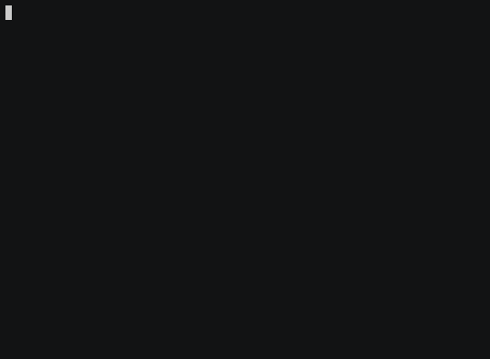

# caverunner

A simple one-file terminal game in Haskell, built with ansi-terminal-game.

## Install

This game is shipped as a single-file script that will run reliably if
you have [stack](https://www.fpcomplete.com/haskell/get-started) in
your PATH. On first run it may seem to hang (perhaps for minutes) if
it needs to download GHC (change its header to --verbosity=info if you
need to see progress).

You can also use cabal and/or your system package manager to install
the haskell packages mentioned in the header, and a suitable GHC
version (eg 8.10), then compile the script.

See also `./caverunner.hs --help`.

## Dev notes

With ansi-terminal-game you describe the whole screen each frame,
and it prints just the minimum changes to the terminal.
[caverunner-fast.anim.gif](caverunner-fast.anim.gif)
shows about the max speed in a 80x25 Terminal.app window on a m1 macbook.

[cave1.hs](old/cave1.hs), built with just print (putStrLn),
went faster ([cave1.anim.gif](old/cave1.anim.gif)),
but couldn't easily get user input.

See the parent directory for more notes.
